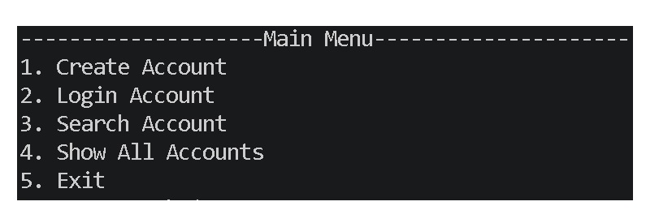
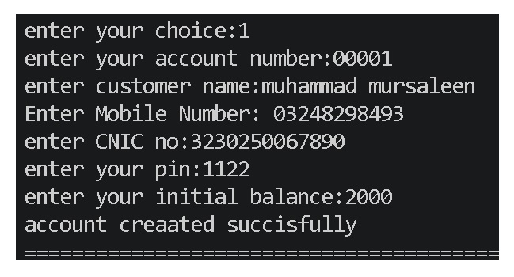
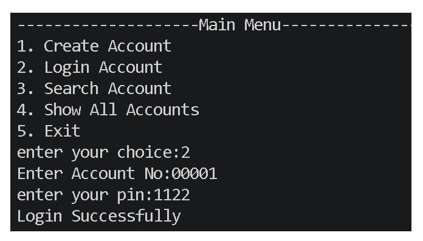
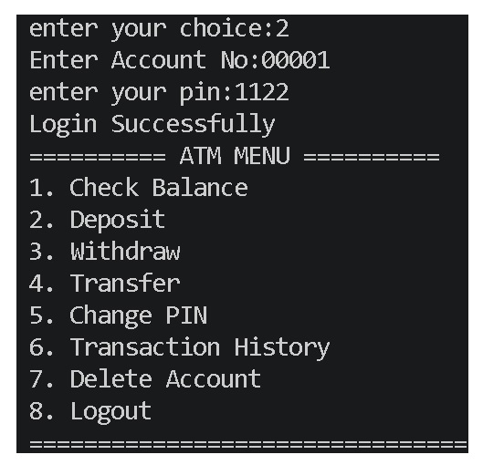
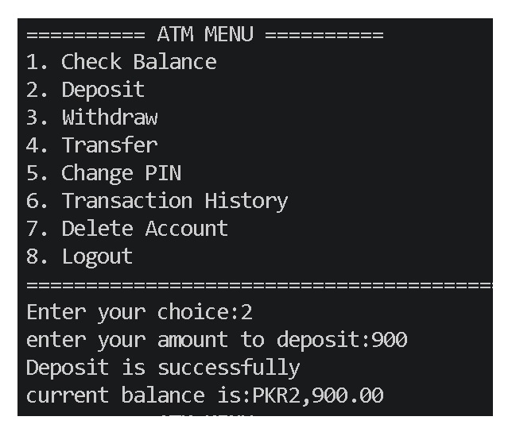
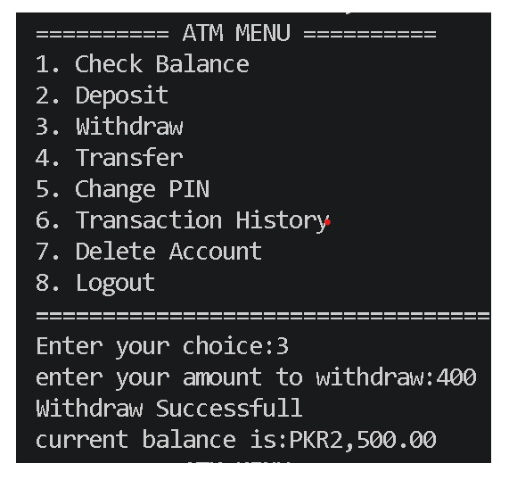
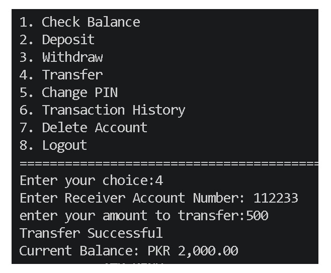
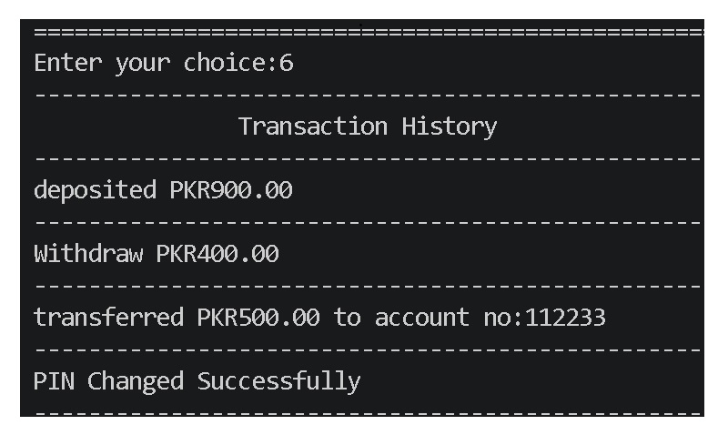
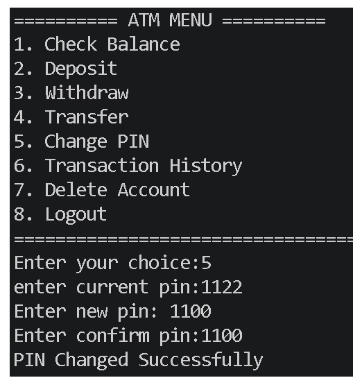
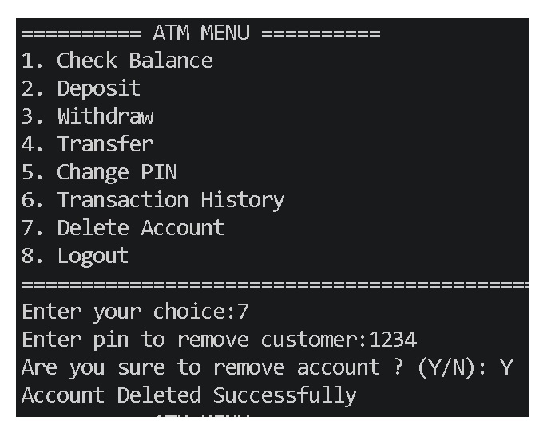

# 🏦 ATM Management System (Python)

A professional ATM Management System built with **Python** using **JSON File Handling**. This project simulates the core functionality of a real ATM system with secure account management, authentication, balance operations, transaction history, and persistent data storage.

---

## ✨ Features

- 🔐 Secure Customer Login (4-digit PIN)
- 🔒 Account Lock After 3 Wrong PIN Attempts
- 👤 Create New Account
- 🔍 Search Customer Account
- 📋 Show All Accounts
- 💰 Check Balance
- ➕ Deposit Money
- ➖ Withdraw Money
- 🔄 Transfer Money
- 🔑 Change PIN
- 📜 Transaction History
- 🗑 Delete Account
- 💾 Permanent Data Storage using JSON

---

## 📁 Project Structure

```
ATM-Management-System_Pro
│
├── main.py
├── customr.py
├── atm.py
├── helper.py
├── database.py
├── database.json
├── screenshots/
└── README.md
```

---

## 🛠 Technologies Used

- Python 3
- JSON
- File Handling
- Functions
- Modules
- Lists
- Dictionaries

---

## 🚀 How to Run

Clone the repository

```bash
git clone https://github.com/MuhammadMursaleen-dev/ATM-Management-System_Pro.git
```

Move into the project folder

```bash
cd ATM-Management-System_Pro
```

Run the project

```bash
python main.py
```

---

# 📸 Project Screenshots

## Main Menu



---

## Create Account



---

## Customer Login



---

## ATM Menu



---

## Deposit Money



---

## Withdraw Money



---

## Transfer Money



---

## Transaction History



---

## Change PIN



---

## Delete Account



---

# 🔒 Security Features

✔ 4-Digit PIN Authentication

✔ Maximum 3 Login Attempts

✔ Account Lock after Wrong PIN Attempts

✔ Duplicate Account Number Validation

✔ Mobile Number Validation

✔ CNIC Validation

✔ PIN Validation

---

# 🎯 Future Improvements

- Admin Panel
- Mini Statement
- PDF Bank Statement
- Interest Calculation
- Loan Management
- Email Notifications
- GUI Version (Tkinter/PyQt)
- MySQL Database
- OOP Version

---

# 👨‍💻 Author

**Muhammad Mursaleen**

GitHub:
https://github.com/MuhammadMursaleen-dev

---

## ⭐ Support

If you found this project helpful, please consider giving it a ⭐ on GitHub.